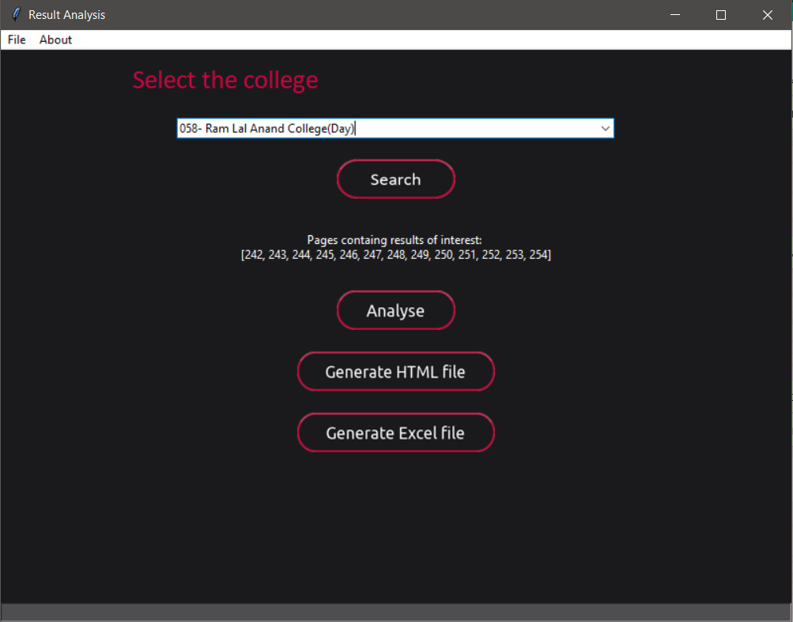

# Result analysis

Result Analysis is tool which is developed for colleges (teachers) to 
analyse the results of the students and keep the track of it.

It extracts the data from the result pdf, extract the tabular data from the pdf and loads into a database. You can 
also generate a combined file of results in other formats like excel and 
html format. It also provides other formatting functionalities for sorting  
records, and removing records. The application is equiped with filtering functionality and interactive graphical data representation  
of the data for ehnached readability.  

## Developed by 

- [Saurav Singh Rawat](https://github.com/Sauravsingh-git)

  
## Screenshots

Homescreen : drag and drop your file or upload manually  

Selecting college : select the college from drop down menu and click on search

Anaylse window : Click on analyse button to open analyse window

Getting graphical representation of the data   

Segregating data based on division  

  
